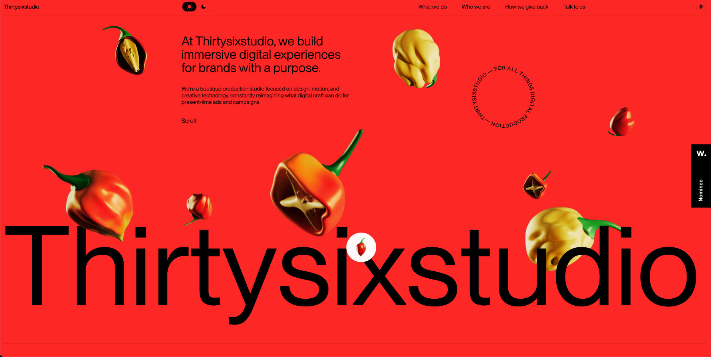

# ThirtySix Studio - Agency Portfolio



Welcome to **ThirtySix Studio**, a modern, minimalistic agency portfolio built with **React**, **Tailwind CSS**, and **GSAP** animations. This project is designed to showcase a sleek, responsive design with interactive animations, suitable for agencies and freelancers looking for a visually engaging portfolio website.

   Important : this blog or portfolio is taken from thirtysixstudio we made like that but with a little different functionality i used to showing beautiful UI.

# Inside the project :
1. when you open my project you will feel like a impactfull blog portfolio with  beautiful coloring.
2. whenever you hover the mouse on the "अप्प दीपो भव" then you will seen the Budhha image  same as for umesh . when you hover the mouse on Umesh then you will see image of Umesh that's a mouse hover image functionality that make beautiful to our react blog.
3. we add 4 naviagtion link in blog also in right corner .
4. we see the cursor with the white circle that is functionality we also added in blog with gsap.
5. the most beautiful functionality is when we click on the Umesh chaudhary then we see the chilly animated and red background that's very beautiful . we made animated to the chilly by using GSAP. and after that when we again click on the Umesh chaudhary then we will see back to home page with black back-ground. so that's very amazing.
6.  So modern design principles with seamless animations to provide an exceptional user experience. Leveraging **React** for the front-end, **Tailwind CSS** for styling, and **GSAP** for smooth animations, this project is a great base for building a high-quality portfolio website.


## Technologies Used

- **React** - JavaScript library for building user interfaces
- **Tailwind CSS** - Utility-first CSS framework
- **GSAP** - Animation library for smooth and advanced animations

---

## Features

- **Smooth Animations:** Animated page transitions and interactive elements powered by GSAP.
- **Minimalistic UI:** Clean, focused design with intuitive navigation.
- **Reusable Components:** Built with reusable and customizable React components.

---

## Getting Started

### Prerequisites

Ensure you have **Node.js** and **npm** installed.

### Installation

1. **Clone the repository:**
   ```bash
   git clone https://github.com/asynchronousJavascriptor/react.gsap.git
   cd react-gsap
   npm install
   npm run dev
   server starts on localhost:5173
